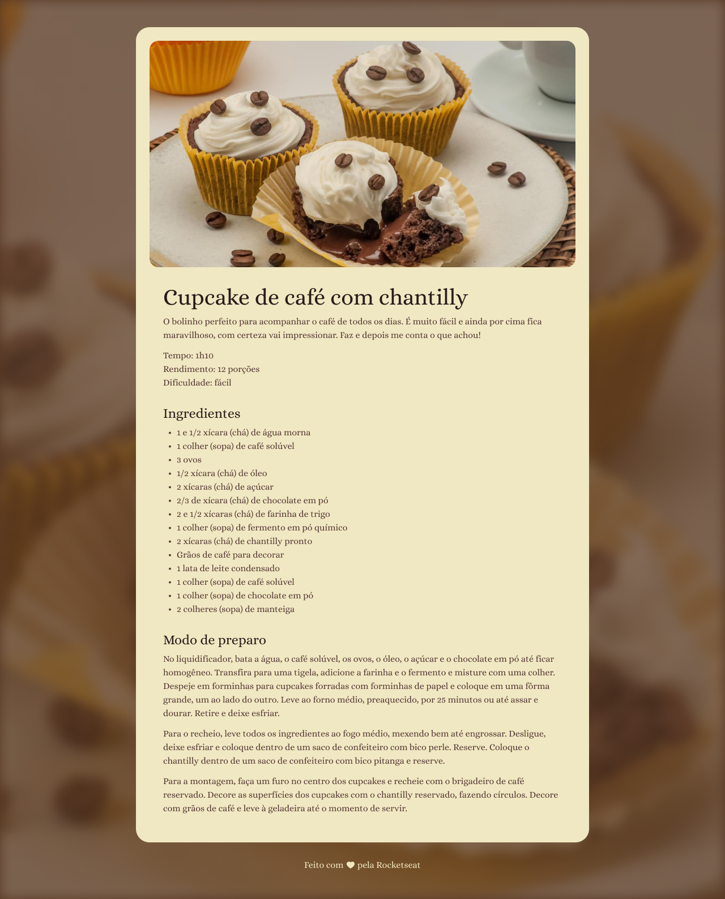

# Página de Receitas

___

Uma página criada para compartilhar **receitas incríveis e saborosas!** Este projeto foi desenvolvido com o objetivo de praticar e aprimorar habilidades em **HTML** e **CSS**, criando uma interface visualmente agradável.

---

## Sobre o Projeto

O **Perfil de Viagens** foi concebido para ser um espaço onde é possível registrar memórias de viagens, como locais visitados, culturas exploradas e dicas para quem deseja embarcar em aventuras semelhantes. A página apresenta um design simples e eficiente, no qual foi criado no **Figma** e posteriormente programada por mim no **HTML** e **CSS**.

---

## Funcionalidades

- **Seções Dinâmicas:** Inclui seções para compartilhar detalhes das dos ingredientes e modo de preparo.
- **Estilização Visual:** Uso de cores harmoniosas, tipografia legível e elementos visuais que remetem ao tema de receitas.

---

## Tecnologias Utilizadas

- **HTML5:** Para estruturar o conteúdo da página.
- **CSS3:** Para estilização, organização visual e responsividade.
- **Figma:** Utilizado para planejar o design do layout e organizar as ideias visuais.

---

## Visualização do Projeto

Veja abaixo uma prévia do design do projeto:

---

Feito com :heart: por Tiago Marques